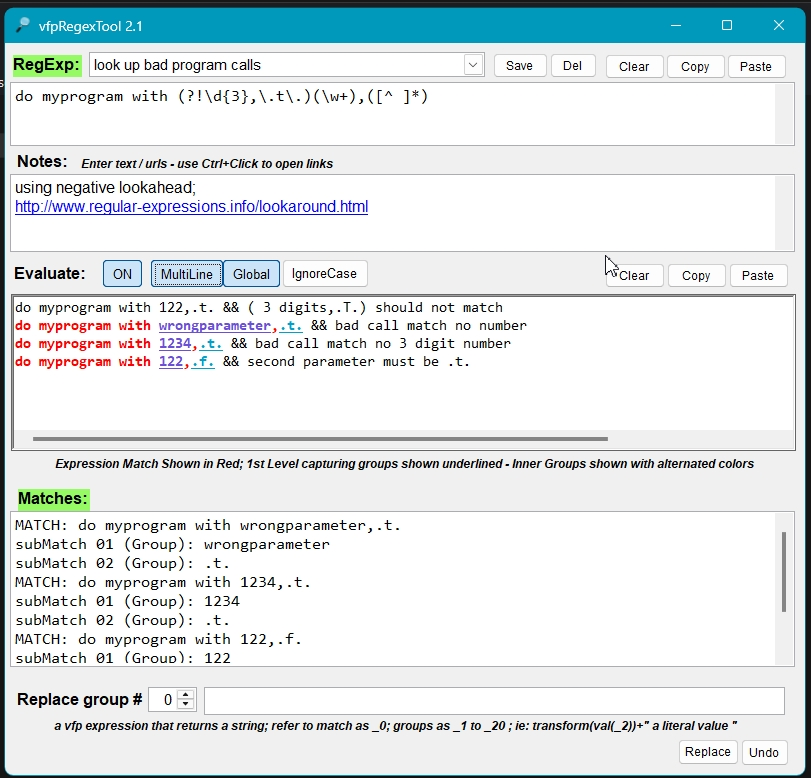

# VFPRegExTool

Project developer: Marco Plaza ( github.com/nfoxdev )

 

Allows you to test regular expressions using  VFP using vbscript.regexp.

Just paste a text snippet and your regular expression, set case sensitive and global options to see the matches highlighted and match / submatch results.

Use it as powerful find/replace tool, perform replace operations over subgroups & setting replace value to any valid foxpro function.

## RELEASE NOTES

24/08/16:  
* Added Evaluate on/off button
* Added Multiline on/off option

22/08/16:  
* Changed project name to vfpRegexTool
* Added option to replace Match or Captured Groups ( submatches ) with any valid vfp expression
* Fixed bugs

16/08/16:  
* Added support for SubMatches Collection
* Group Captures indicated with underline, subgroup match highlighted in different colours
* Real-Time Regexp Evaluation as you type
* Allows you to save / load your regexp with associated text & help
* Buttons for copy/clip regexp & sample text
* Window resize support
* Preloaded with some regexp samples for you to test

16/08/16:  
* saved samples retain IgnoreCase/Global settings
* RegExp Title toggles Green/Red background indicating regexp is Ok/Invalid
* Result Title toggles Green/Red background indicating Match/no-Match

## Important Notes
Infinite backloops regular expressions will hang the engine ( no vbscript.regex option for timeout operation )
Prefer small text samples to get fast results & good use experience

Zip file contains source files and compiled exe.

Useful Links:
* [https://msdn.microsoft.com/en-us/library/ms974570.aspx#scripting05_topic2](https://msdn.microsoft.com/en-us/library/ms974570.aspx#scripting05_topic2)
* [https://msdn.microsoft.com/en-us/library/aa976858%28v=vs.71%29.aspx?f=255&MSPPError=-2147217396](https://msdn.microsoft.com/en-us/library/aa976858%28v=vs.71%29.aspx?f=255&MSPPError=-2147217396)
* [http://www.regular-expressions.info/lookaround.html](http://www.regular-expressions.info/lookaround.html)
* [https://regex101.com/](https://regex101.com/)
